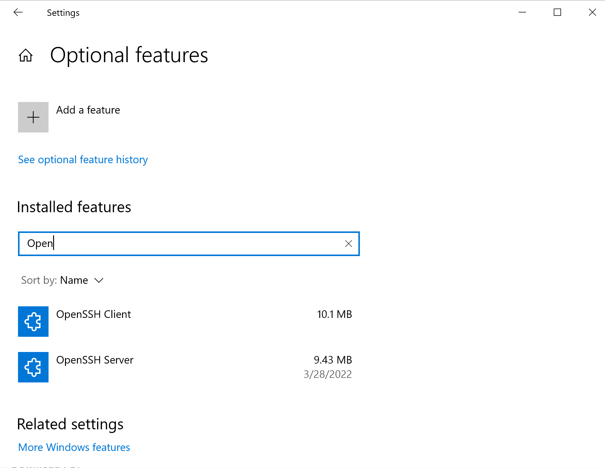
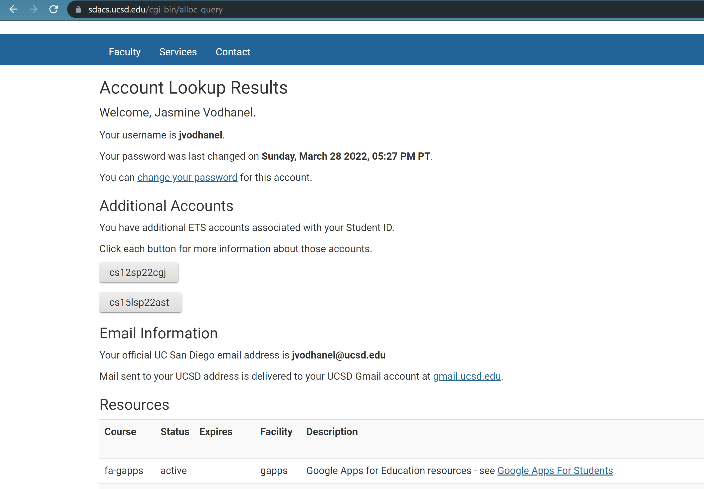
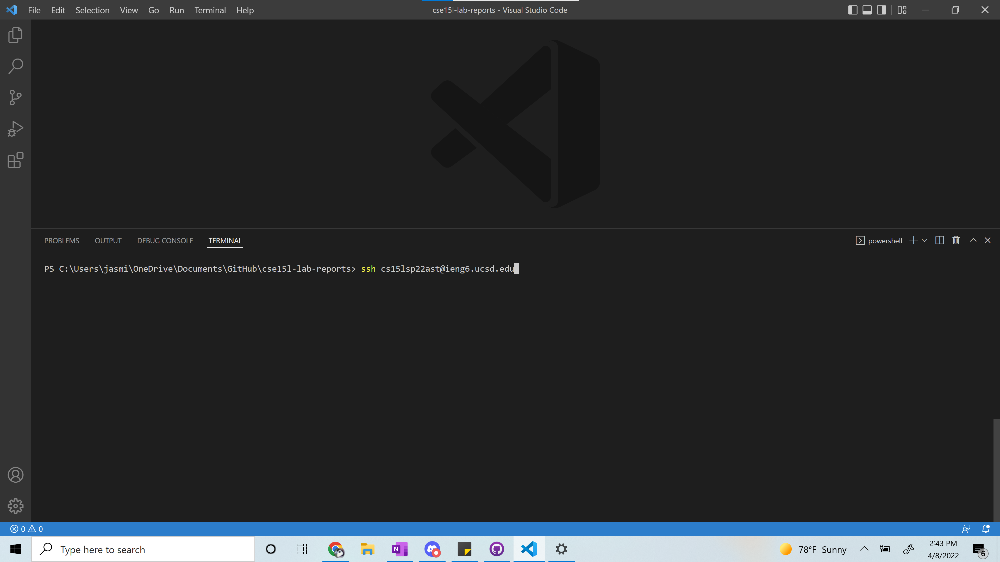
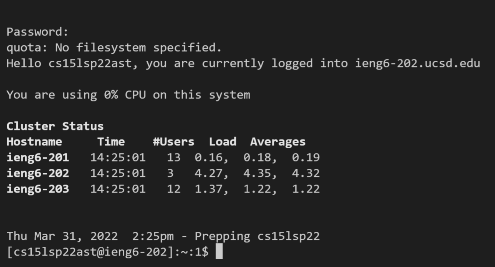
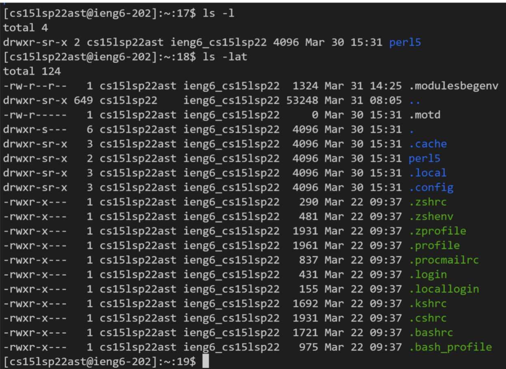
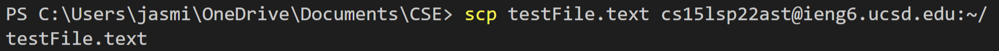
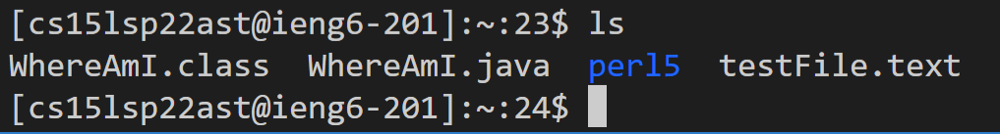
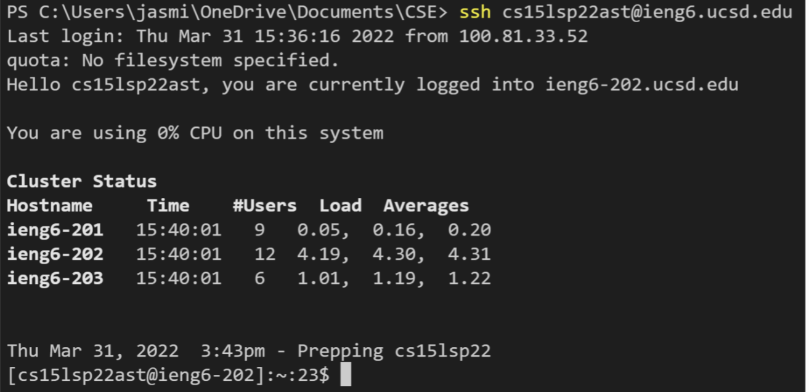
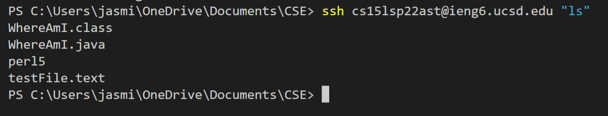

# Week 2 Lab Report
## Logging into a course specific account on ieng6   
 
 

### Installing VScode
- To install Visual Studio Code go to their website and choose the option appropriate for your device

- After it is installed, opening VScode should look something similar to this:

   
 
 

### Remotely connecting

- First, make sure you have OpenSSH installed by going to "Settings", "Apps", "Optional Features", then search for OpenSSH. If not installed already, install OpenSSH Client and OpenSSH Server now. 

- Then find your course specific account on [https://sdacs.ucsd.edu/~icc/index.php](https://sdacs.ucsd.edu/~icc/index.php). You will use this account to connect remotely. 

- To connect to the remote host, open the terminal in VScode and type "ssh" and the name of your account.

- The first time connecting to the server will give you a message asking if you are sure you want to connect, so type "yes" and press enter.
- Then it will ask for your password, type your password in and press enter. *(Note: when you type your password it will not show up in the terminal, but it is typing)*

- When you've successfully connected, you will see something similar to this.  
 
 

### Running some commands
- To run some basic commands type into the terminal.
- Some commands to try are "ls" which shows a list of nonhidden files and directories, "cat" plus a directory creates a new file, "echo" plus text >> text file adds text to the end of a text file.
- You can also combine some commands like "ls - lat" or "ls -a" and compare the difference.

  
 
 

### Moving files with scp
- To move files using the scp command, write them in this format, using the appropriate file name and your own username.

- To check if this worked, you can connect to the host and use the command "ls" like this:
  
 
 

### Setting an SSH Key
- To set up your ssh key, first type the command "ssh-keygen".
- Then, enter the file to save the key in, using your own username: (/Users/<user-name>/.ssh/id_rsa): /Users/<user-name>/.ssh/id_rsa
- Then it will ask for a passphrase, do not type in a passphrase, just press enter.
- If you are on Windows, follow the extra ssh-add steps here [extra steps for Windows](https://docs.microsoft.com/en-us/windows-server/administration/openssh/openssh_keymanagement#user-key-generation).

- Now to copy the public key to the .ssh directory for your user account on the server, connect to the host, use the command "mkdir .ssh" and log out. Then use the command "scp /Users/<user-name>/.ssh/id_rsa.pub
cs15lsp22zz@ieng6.ucsd.edu:~/.ssh/authorized_keys" using your username and account to copy over the key. 

- Now you should be able to connect without typing in a password like in this picture.   
 
 

### Optimizing Remote Running 
- One shortcut you can use when connecting to the server and using commands is by connecting to the server usnig the normal command then adding a command you want to run on the server in quotes. This way it will run the command on the server after you connect in the same line. 

- Another helpful tip, you can recall the last command that you ran by using the up arrow on your keyboard. 

