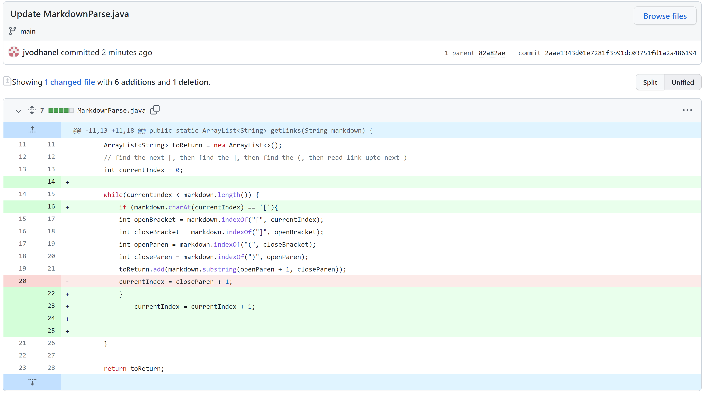
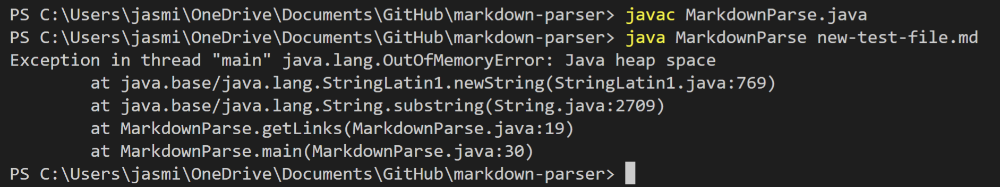
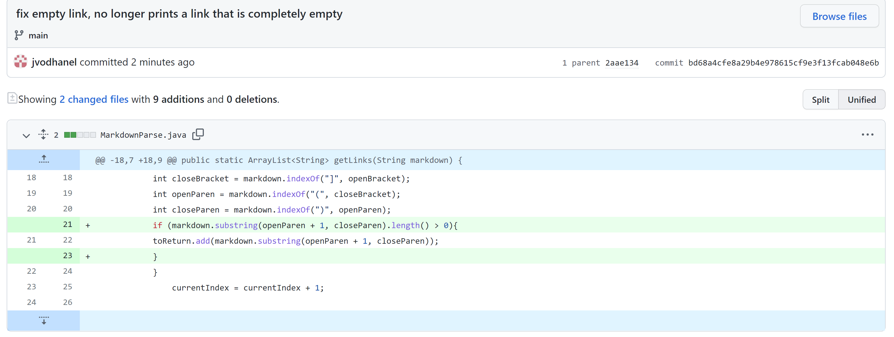
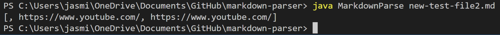
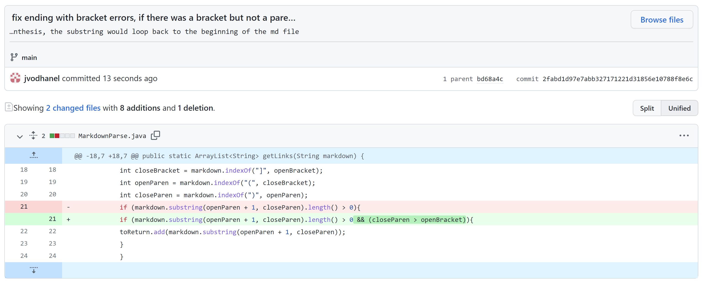
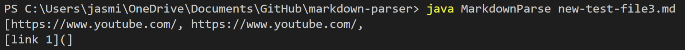

# Lab Report 2

## Change 1  
 

### Screenshot of code change
  
 

### Link to test file with failure inducing input
[test file 1](https://github.com/jvodhanel/markdown-parser/blob/main/new-test-file.md)  
 

### Symptom of failure inducing input
  
 

### Relationship between bug, symptom, and failure inducing input
In this change, the failure inducing input was adding any text after the end of a link. As a result, the symptom was a loop that would go on forever and only end with an out of memory error. The bug was that the current index would keep updating itself to the index after the last closed parenthesis, so if there wasn't a new link, it would keep updating to the same index.   
 
  
 

## Change 2  
 

### Screenshot of code change
  
 

### Link to test file with failure inducing input
[test file 2](https://github.com/jvodhanel/markdown-parser/blob/main/new-test-file2.md)  
 

### Symptom of failure inducing input
  
 

### Relationship between bug, symptom, and failure inducing input
For this test, the symptom was if the area between the brackets where the link would be read was completely empty, the code would still print an empty space and a comma. Obviously, this is wrong because there is no link to be printed. To fix the bug, I created an if statement that would only add the subtring of the link if the length of the substring was greater than 0, that way it would not add an empty space.

## Change 3  
 

### Screenshot of code change
  
 

### Link to test file with failure inducing input
[test file 3](https://github.com/jvodhanel/markdown-parser/blob/main/new-test-file3.md)  
 

### Symptom of failure inducing input
  
 

### Relationship between bug, symptom, and failure inducing input
The symptom here was more obvious because it printed something that looks like the first part of what must be typed to create a link in markdown. This symptom was created by inputing "[]" at the end of the file without also including "()", so the code created a substring by looping to the beginning of the file again. To fix the bug, I added another condition into the if statement I created earlier, and I added that the int variable for closeParen should be greater than openBracket. 