# Lab Report 3

## Streamlining SSH Configuration   
 

For this task, I chose to make my alias "jvodhanel15l". So I added lines to the .ssh/config file so that I could login with this name as a shortcut rather than typing out my longer school username "cs15lsp22ast@ieng6.ucsd.edu".

  
 

### .ssh/config file
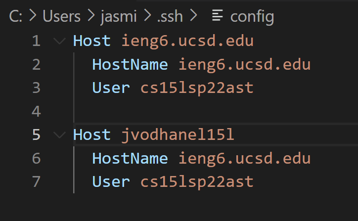  
 

### SSH command logging in using alias
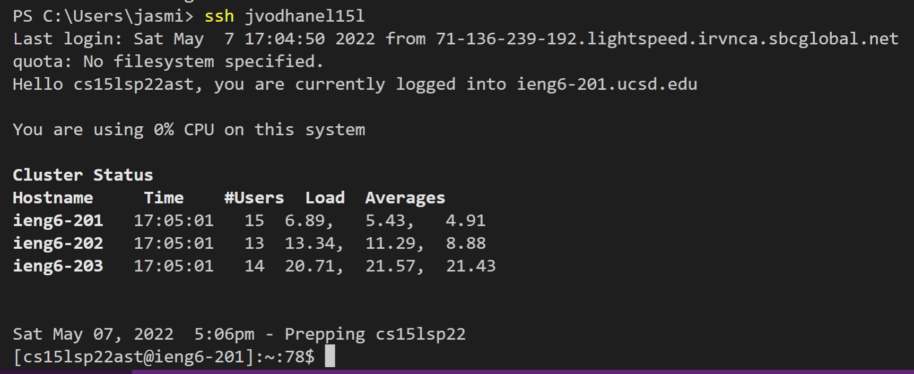
  
 

### Copying a file using alias
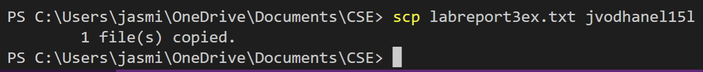
  
 

## Setup Github Access from ieng6
  
 

For this task I generated a new public/private key pair and added the public key to my accound in Github. This way I can commit and push changes to Github while logged into my ieng6 account. To demonstrate this, I created a new text file and commited and pushed the new file to Github. 
  
 

### Public key in Github
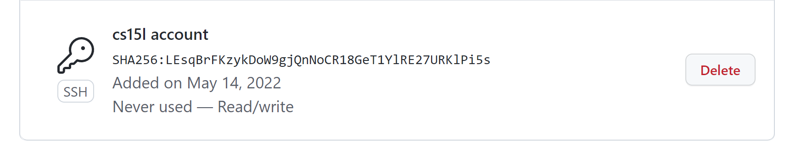
  
 

### Private key location
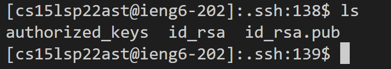
  
 

### Git commands on ieng6 account
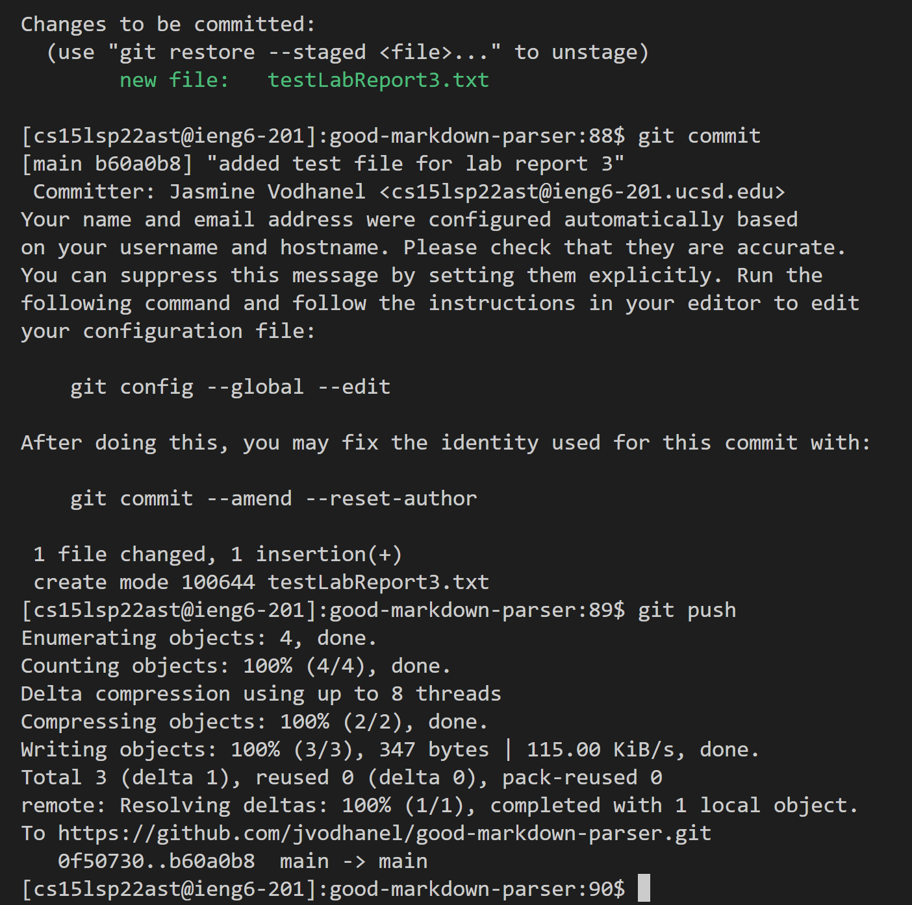
  
 

### Link to commit
[link to commit](https://github.com/jvodhanel/good-markdown-parser/actions/runs/2288284747)
  
 

## Copy whole directories with scp -r
  
 

For this task I copied my markdown-parse directory to a new directory called lab-report-3 on my ieng6 account. I was able to use the command to compile the tests, but I ran into errors in my test that I will have to fix, but I was able to show that I can use the command to attempt to run the tests after I copied the directory over. 
  
 

### Copying whole markdown-parse directory to ieng6 account
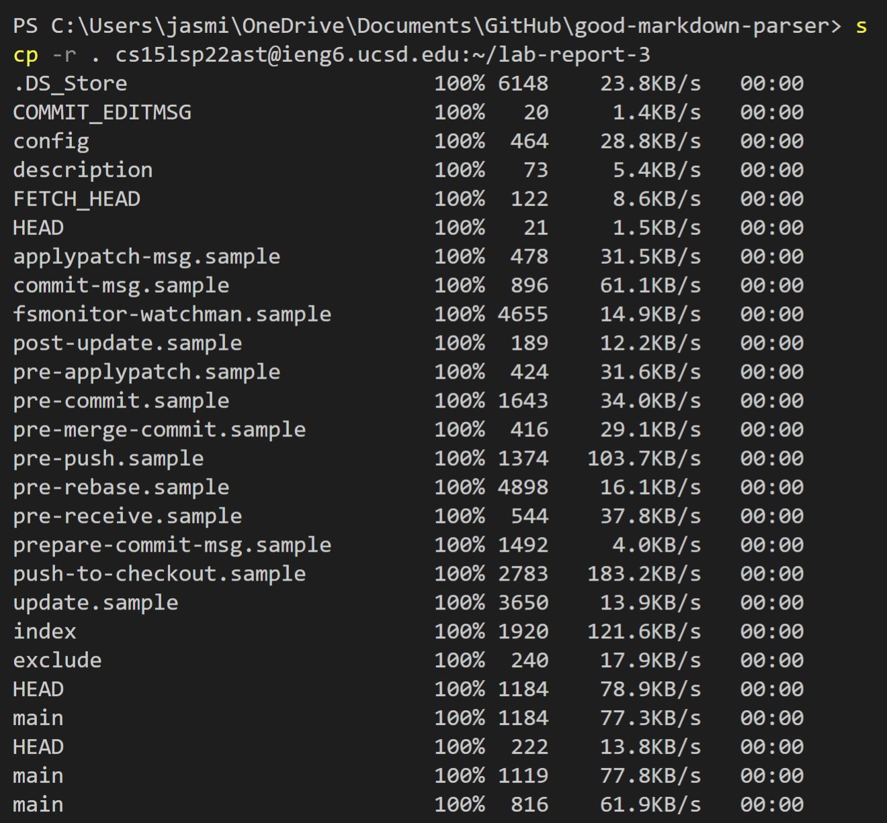

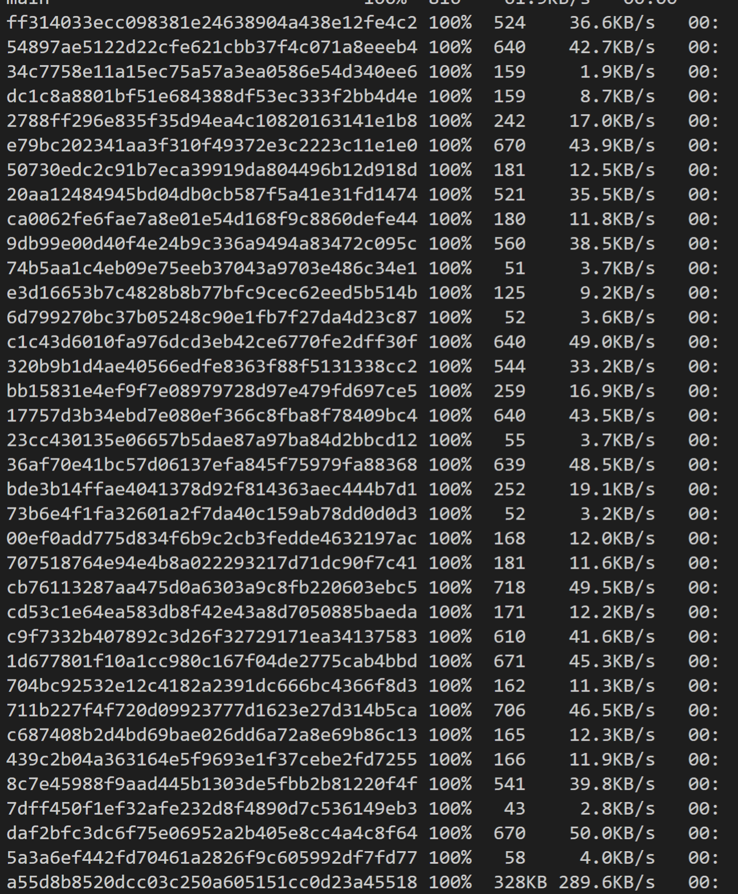

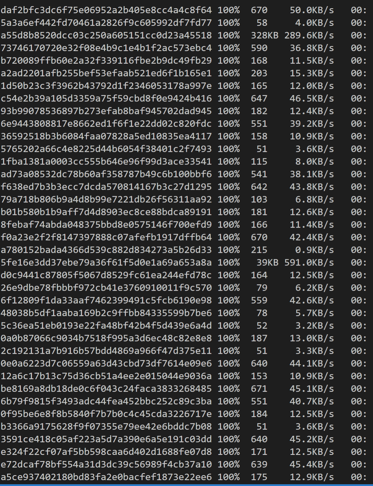

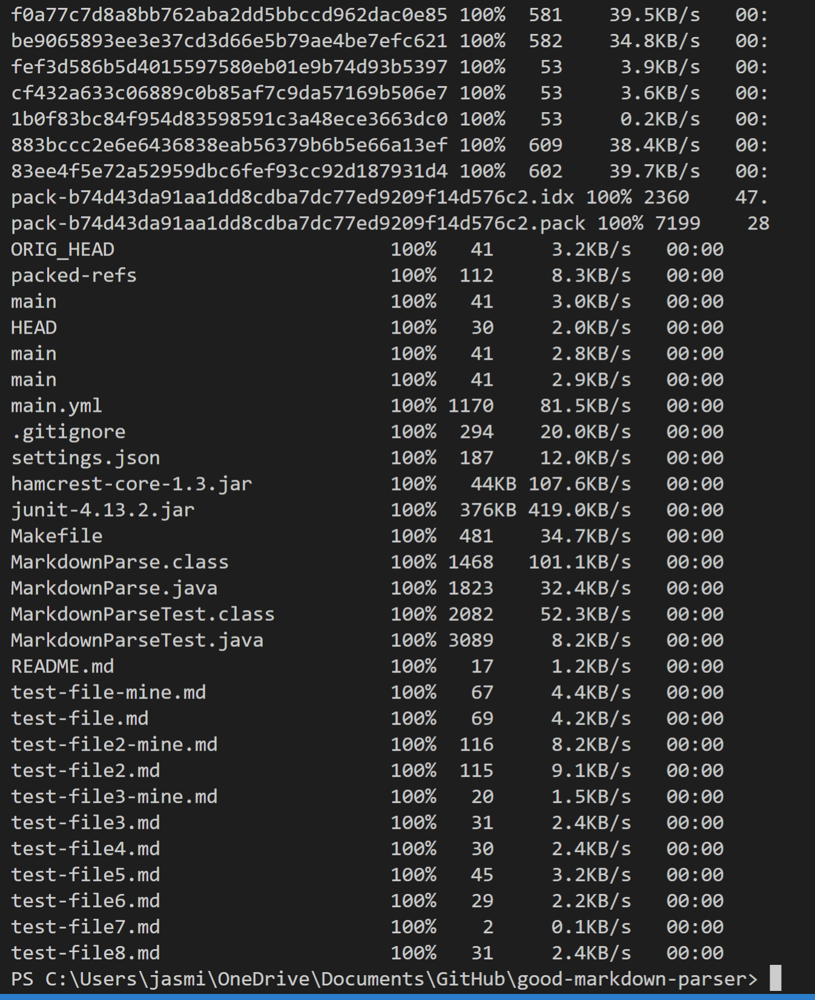
  
 

### Logging into ieng6 accound and compiling and running tests

  
 

### Combining scp, ; ,and ssh
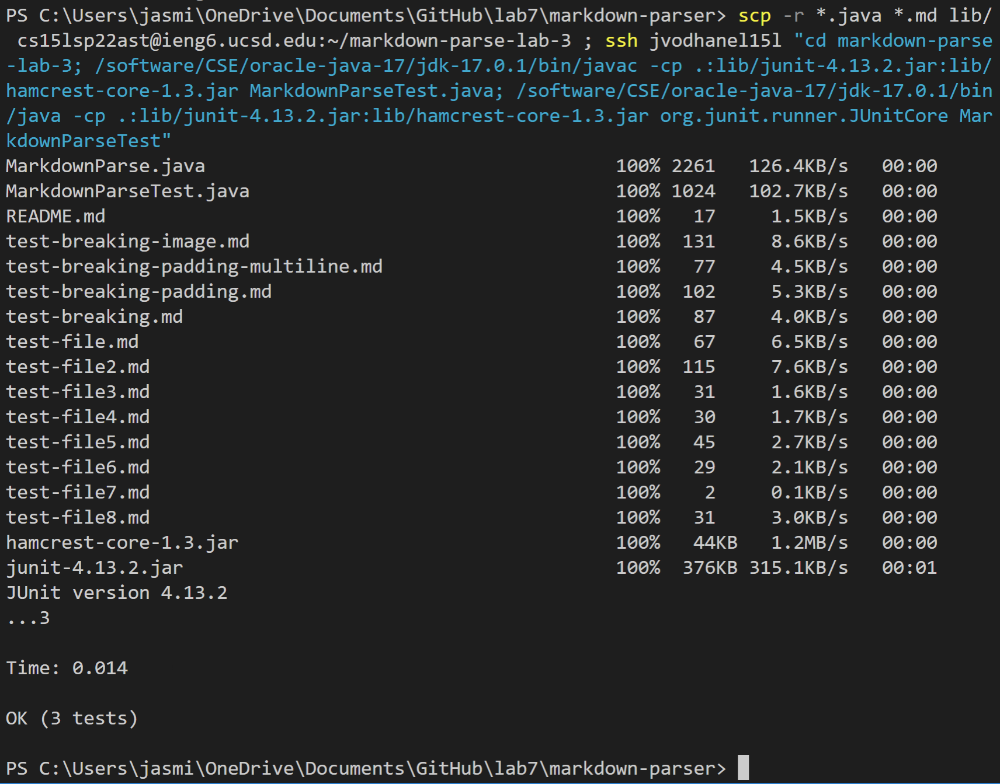