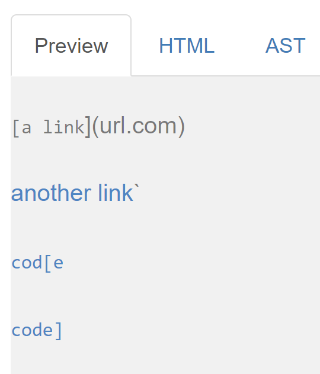
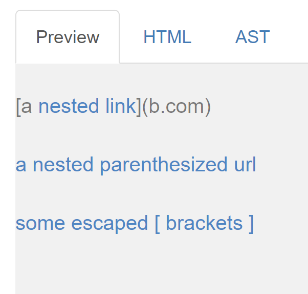
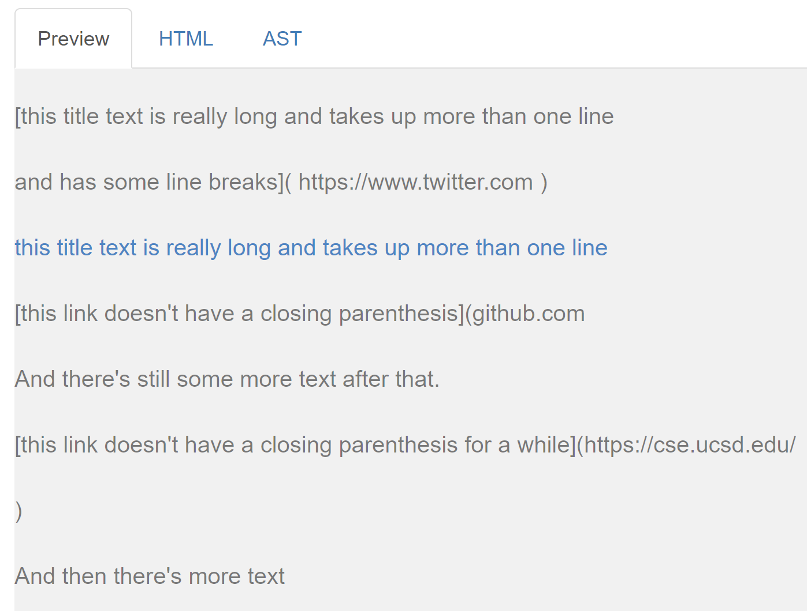
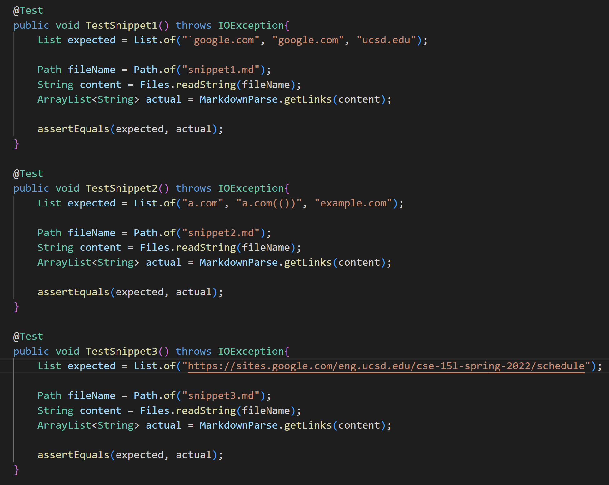

# Lab Report 4   
 

## Links to markdown-parse repositories
  

[link to our group markdown-parse repository](https://github.com/ryankosta/good-markdown-parser)  

[link to review group's markdown-parse repository](https://github.com/UDXS/markdown-parser)
  
 

## Expected output (based on CommonMark demo site)
  

### Snippet 1

Expected Output: "`google.com", "google.com", "ucsd.edu"
 
 

### Snippet 2

Expected Output: "a.com", "a.com(())", "example.com"
 
 

### Snippet 3

Expected Output: "https://sites.google.com/eng.ucsd.edu/cse-15l-spring-2022/schedule"
 
 

## Code for Tests

