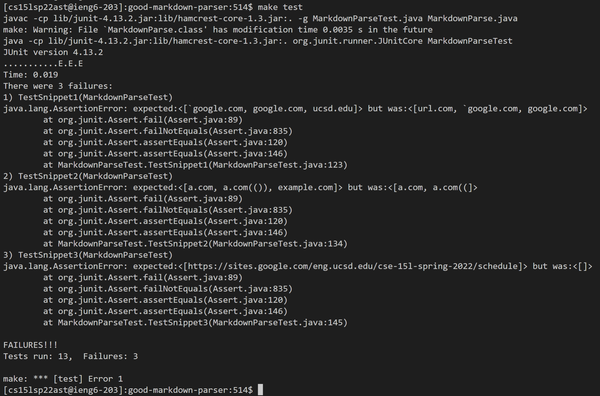

# Lab Report 4   
 

## Links to markdown-parse repositories
  

[link to our group markdown-parse repository](https://github.com/ryankosta/good-markdown-parser)  

[link to review group's markdown-parse repository](https://github.com/UDXS/markdown-parser)
  
 

## Expected output (based on CommonMark demo site)
  

### Snippet 1
 

Expected Output: "`google.com", "google.com", "ucsd.edu"
 
 

### Snippet 2
 

Expected Output: "a.com", "a.com(())", "example.com"
 
 

### Snippet 3
 

Expected Output: "https://sites.google.com/eng.ucsd.edu/cse-15l-spring-2022/schedule"
 
 

## Code for Tests

 
 

## Our implementation output

 
 

## Review implementation output
![reviewcodeoutput] (reviewCodeOutput.PNG)
 
 

## Questions
### Snippet 1
I think that a small change could make this program work for snippet 1 and related cases that use inline code with backticks. I would change the code to ignore brackets and similar symbols if they're between backticks. So I would need to be able to check for backticks and also determine if a symbol like a parenthesis or a bracket is between the backticks and then ignore them if this is true.
 

### Snippet 2
I think fixing the issues with snippet 2 and other related cases with nested parenteses, brackets, and escaped brackets would require a bigger change to the code because it would be difficult to determine and differentiate between these nested symbols and the ones that are actually being used to create the markdown link. It would also be hard to make code that would work for all cases since there could be multiple nested symbols. Another reason it could be difficult is because it seems like there are different rules for how parentheses and brackets are handled, so the solution wouldn't be universal for all these situations. 
 

### Snippet 3
I believe that a small change could make this program work for snippet 3 and other related issues with newlines in brackets and parenteses. I would probably change the code to ignore newlines in between brackets and parentheses. This would mean I would also need to determine if a newline was found between a set of parentheses or brackets in order for me to decide to ignore it or not. 