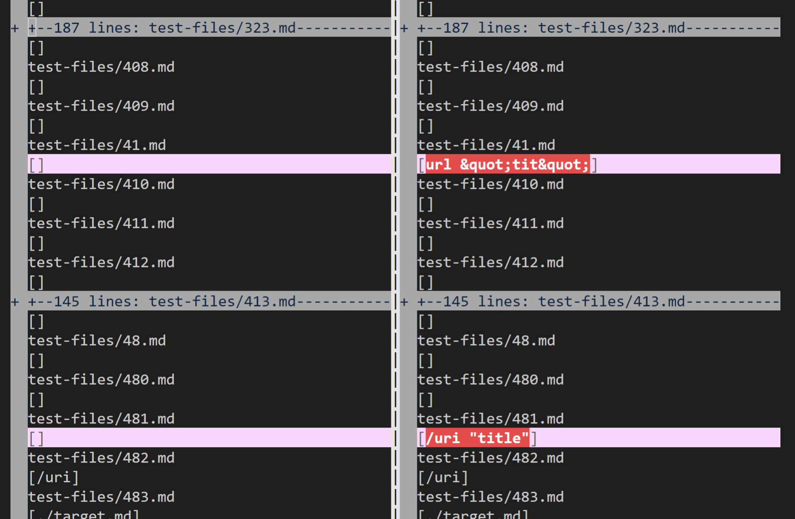
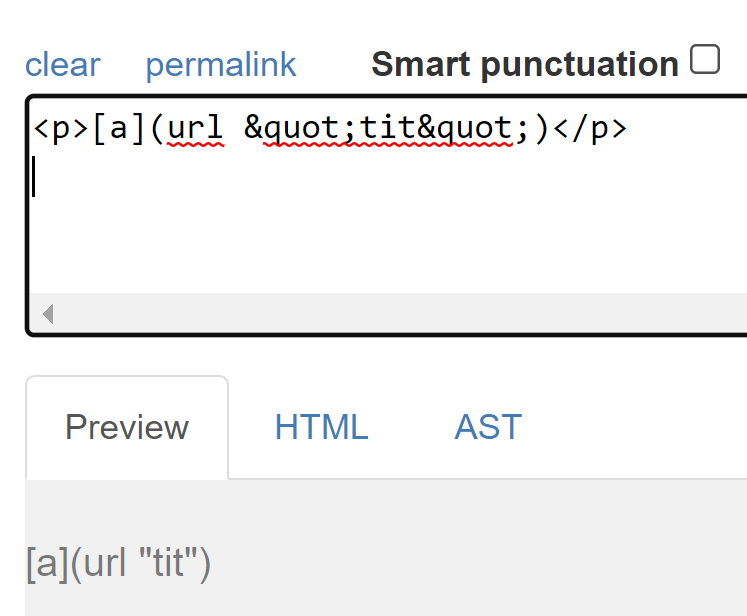
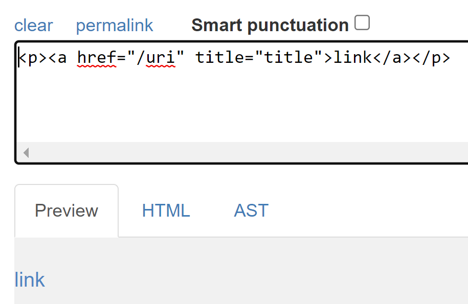
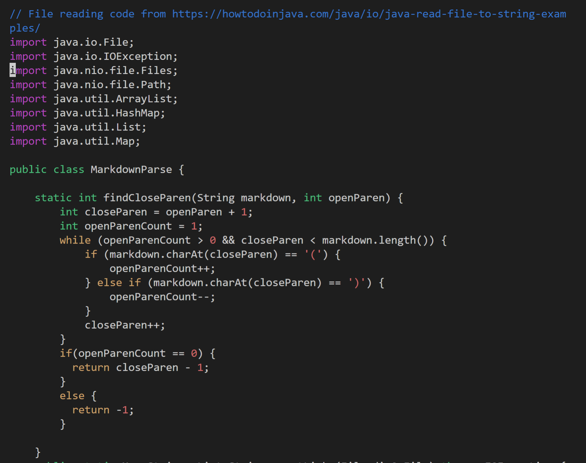
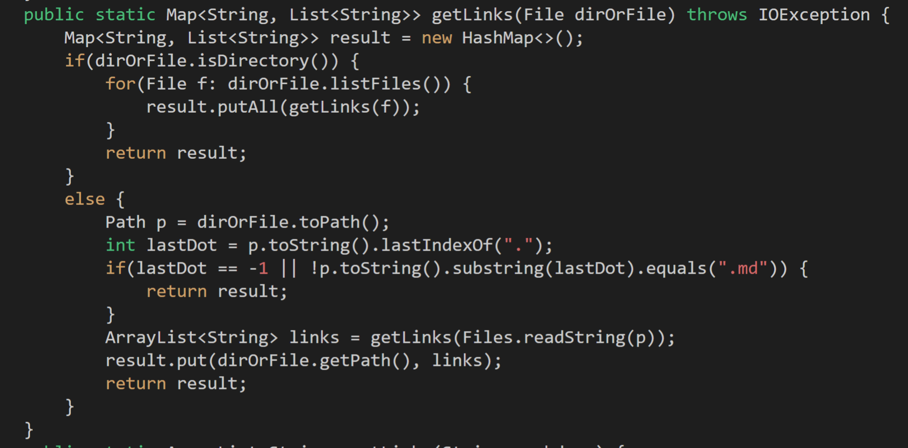
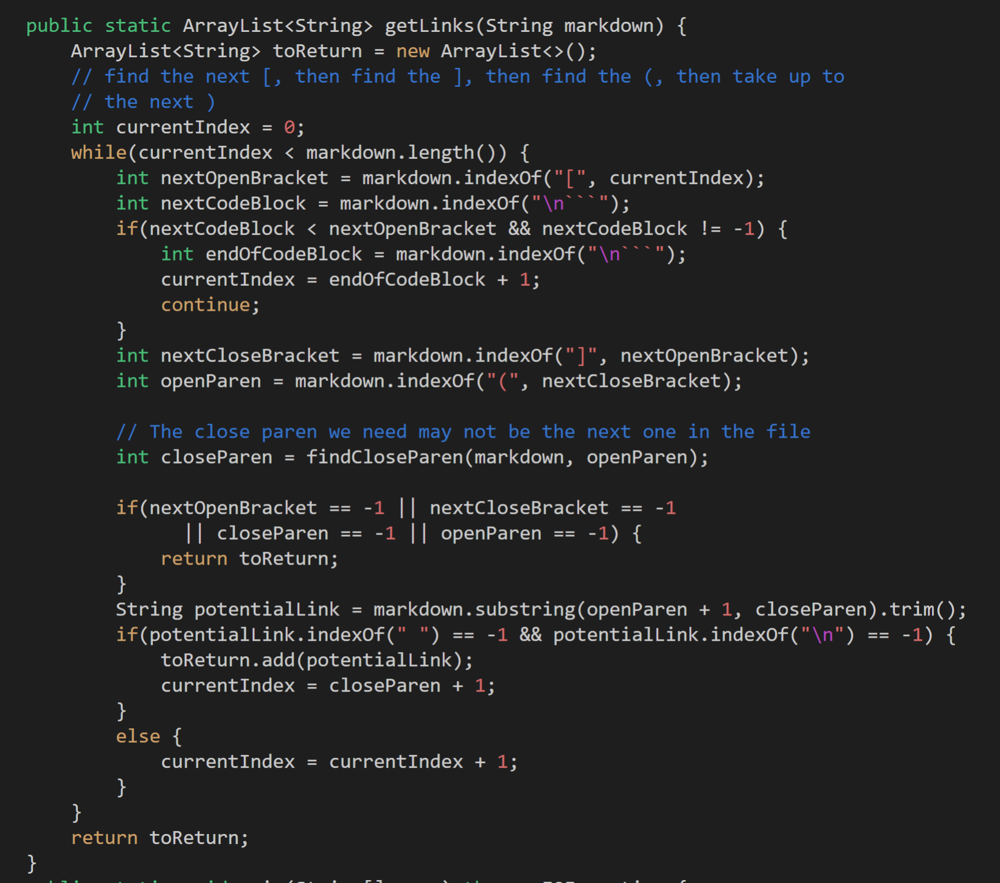
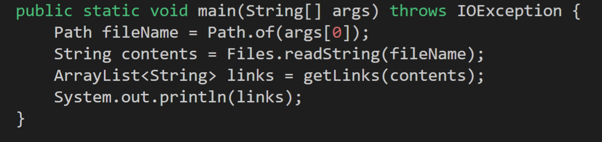
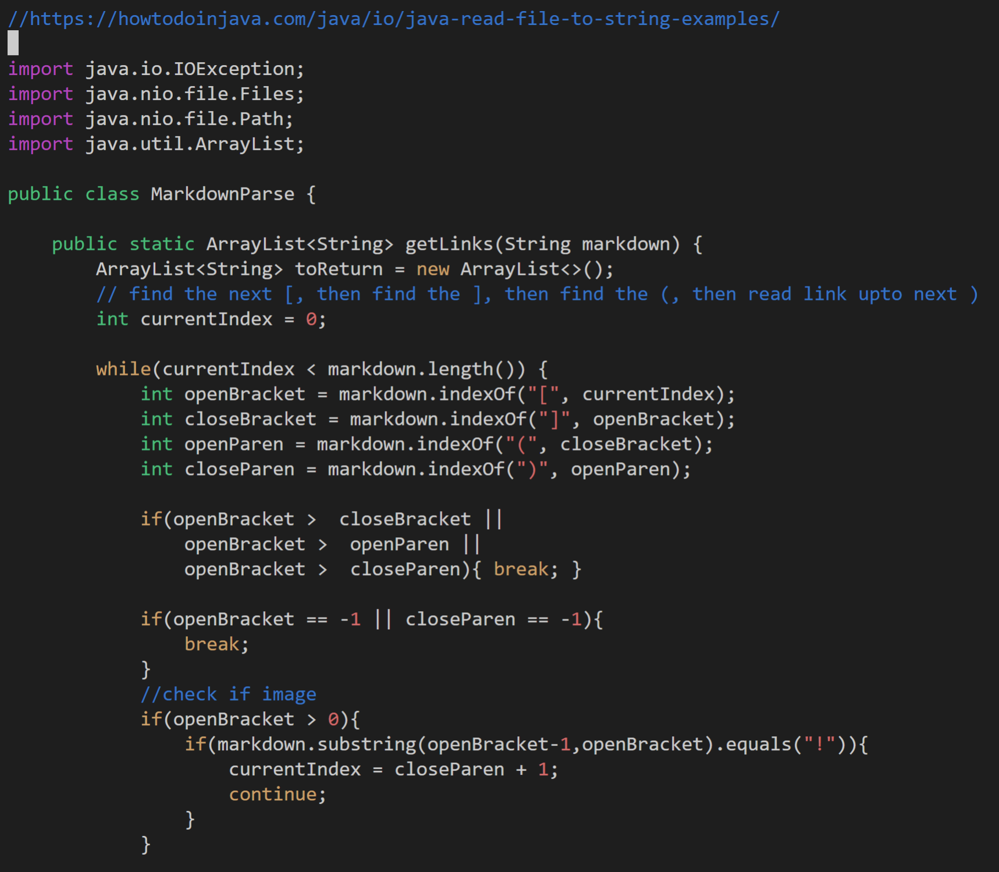
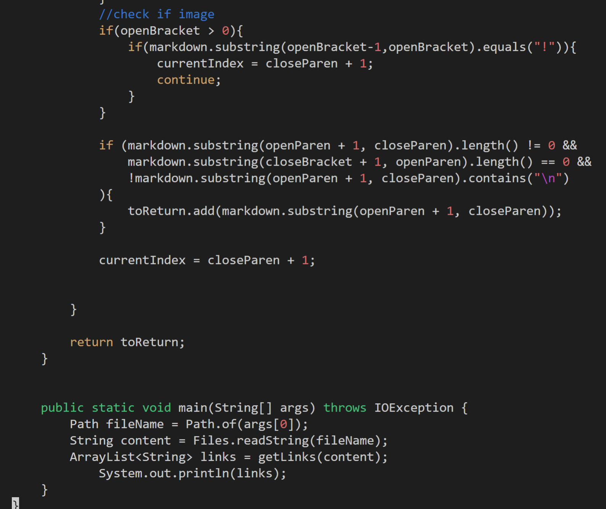

# Lab Report 5

## How I found the tests
 

I found the tests that created different outputs for the given MarkdownParser and our MarkdownParse using vimdiff on the results.txt files that I created for the given MarkdownParser and for our group MarkdownParser. 
 
 

## Links to test files with different results 
 

Test 41
 
[markdown file](https://github.com/nidhidhamnani/markdown-parser/blob/main/test-files/41.md)
 
[html.test](https://github.com/nidhidhamnani/markdown-parser/blob/main/test-files/41.html.test)
 
 

Test 481
 
[markdown file](https://github.com/nidhidhamnani/markdown-parser/blob/main/test-files/481.md)
 
[html.test](https://github.com/nidhidhamnani/markdown-parser/blob/main/test-files/481.html.test)
 
 
 

## Actual outputs vs Expected
 
 

The given MarkdownParser was correct for test 41 because it returned "[]" with the given file but it was incorrect for test 481 because it returned "[]" for the given file when it should have returned "[/uri]".

Our group MarkdownParser was incorrect for test 41 because it returned "[[url &quot;tit&quot;]]" when it should have returned "[]" and it was incorrect for test 481 because it returned "[/uri "title"]" when it should have returned "[/uri]".

(given MarkdownParser on the left, our group MarkdownParser on the right)

 

The expected output based on CommonMark was "[]" for test 41 and "[/uri]" for test 481
 
### Test 41

### Test 481 

 
 

### Given MarkdownParser 
For test 481, the test that it gave an incorrect output for, the problem is that CommonMark expects a link here since it uses HTML link syntax but the MarkdownParser does not have code to account for this syntax and read it. So to solve this issue would require a lot more code to be added to account for HTML link syntax. 

 
 

### Our group MarkdownParser
For test 41, the problem with our parser is that it does not disregard a link if it has a space in the middle of it. This would probably require the addition of some if statement that could check if there is a space where the link should be. 

For test 481, the problem is similar to the given MarkdownParser because this parser does not account for HTML link syntax. So it would require a lot more code to be added to this parser. 

